# Quantum Scheduling Batch Results Comparison

## Execution Status

| Algorithm | Status | Error |
|-----------|--------|-------|
| FFD | ✅ SUCCESS |  |
| LPT | ✅ SUCCESS |  |
| QGroup | ✅ SUCCESS |  |

## Workload and Configuration

- **Circuits**: 4 (ghz)
- **Average Qubits**: 3.5
- **Machines**: ["fake_belem", "fake_bogota"]
- **Seed**: 0
- **Queue Policy**: strict
- **Baseline Algorithm**: FFD

## Scheduling Latency (wall-clock)

| Algorithm | Latency (s) | Difference from baseline |
|-----------|-------------|-------------------------|
| FFD | 0.0001373 | baseline |
| LPT | 0.0001271 | -1.025e-05 |
| QGroup | 0.0180 | +0.0179 |

## Execution Summary Metrics

All times in seconds (virtual execution time) unless specified otherwise.

| Metric | FFD | LPT | QGroup |
|--------|--------|--------|--------|
| Schedule Latency | 0.0001373 | 0.0001271 (-1.025e-05, -7.47%) | 0.0180 (+0.0179, +13019.10%) |
| Makespan | 0.1255 | 0.0619 (-0.0637, -50.72%) | 0.0610 (-0.0645, -51.39%) |
| Total Turnaround Time | 0.2639 | 0.1421 (-0.1218, -46.15%) | 0.0796 (-0.1843, -69.83%) |
| Total Waiting Time | 0.0704 | 0.0613 (-0.0091, -12.88%) | 0.0061 (-0.0643, -91.36%) |
| Total Response Time | 0.0704 | 0.0613 (-0.0091, -12.88%) | 0.0061 (-0.0643, -91.36%) |
| Avg Turnaround Time | 0.0660 | 0.0355 (-0.0304, -46.15%) | 0.0199 (-0.0461, -69.83%) |
| Avg Waiting Time | 0.0176 | 0.0153 (-0.0023, -12.88%) | 0.0015 (-0.0161, -91.36%) |
| Avg Response Time | 0.0176 | 0.0153 (-0.0023, -12.88%) | 0.0015 (-0.0161, -91.36%) |
| Job Completion Rate | 31.8675 | 64.6635 (+32.7960, +102.91%) | 65.5587 (+33.6912, +105.72%) |
| Avg Fidelity | 0.8521 | 0.8483 (-0.0038, -0.45%) | 0.8552 (+0.0030, +0.36%) |
| Cutting Overhead | N/A | N/A | N/A |

**Metric Definitions:**

- **Schedule Latency**: Wall-clock scheduling decision time (s)
- **Makespan**: Total virtual execution time (s)
- **Total Turnaround Time**: Sum of all job turnaround times (s)
- **Total Waiting Time**: Sum of all job waiting times (s)
- **Total Response Time**: Sum of all job response times (s)
- **Avg Turnaround Time**: Mean turnaround time across jobs (s)
- **Avg Waiting Time**: Mean waiting time across jobs (s)
- **Avg Response Time**: Mean response time across jobs (s)
- **Job Completion Rate**: Throughput: completed jobs / makespan
- **Avg Fidelity**: Mean quantum circuit execution fidelity
- **Cutting Overhead**: Total sampling overhead incurred from circuit cutting

**Note**: Values in parentheses show (difference from baseline, % change)

## Job Outcomes

| Algorithm | Succeeded | Failed | Blocked | Total |
|-----------|-----------|--------|---------|-------|
| FFD | 4 | 0 | 0 | 4 |
| LPT | 4 | 0 | 0 | 4 |
| QGroup | 4 | 0 | 0 | 4 |

## Machine Utilization

| Machine | FFD Util | LPT Util | QGroup Util | FFD Busy Time | LPT Busy Time | QGroup Busy Time |
|---|---|---|---|---|---|---|
| fake_belem | 1.0000 | 1.0000 | 0.8998 | 0.13s | 0.06s | 0.05s |
| fake_bogota | 0.0512 | 0.9775 | 1.0000 | 0.01s | 0.06s | 0.06s |

**Note**: Utilization measures logical qubit allocation over capacity × makespan.

## Batch Execution Records

### FFD Batches

Total batches: 3

| Batch | Machine | Jobs | Shots | Start | End | Duration | Status |
|-------|---------|------|-------|-------|-----|----------|--------|
| 1 | fake_belem | 1 | 1024 | 0.00s | 0.07s | 0.07s | SUCCEEDED |
| 2 | fake_bogota | 2 | 1024 | 0.00s | 0.01s | 0.01s | SUCCEEDED |
| 3 | fake_belem | 2 | 1024 | 0.07s | 0.13s | 0.06s | SUCCEEDED |

### LPT Batches

Total batches: 5

| Batch | Machine | Jobs | Shots | Start | End | Duration | Status |
|-------|---------|------|-------|-------|-----|----------|--------|
| 1 | fake_belem | 1 | 1024 | 0.00s | 0.01s | 0.01s | SUCCEEDED |
| 2 | fake_bogota | 1 | 1024 | 0.00s | 0.05s | 0.05s | SUCCEEDED |
| 3 | fake_belem | 1 | 1024 | 0.01s | 0.01s | 0.01s | SUCCEEDED |
| 4 | fake_belem | 1 | 1024 | 0.01s | 0.06s | 0.05s | SUCCEEDED |
| 5 | fake_bogota | 1 | 1024 | 0.05s | 0.06s | 0.01s | SUCCEEDED |

### QGroup Batches

Total batches: 4

| Batch | Machine | Jobs | Shots | Start | End | Duration | Status |
|-------|---------|------|-------|-------|-----|----------|--------|
| 1 | fake_belem | 2 | 1024 | 0.00s | 0.01s | 0.01s | SUCCEEDED |
| 2 | fake_bogota | 1 | 1024 | 0.00s | 0.01s | 0.01s | SUCCEEDED |
| 3 | fake_belem | 1 | 1024 | 0.01s | 0.05s | 0.05s | SUCCEEDED |
| 4 | fake_bogota | 1 | 1024 | 0.01s | 0.06s | 0.05s | SUCCEEDED |

## Visualizations

### Overview Metrics Comparison

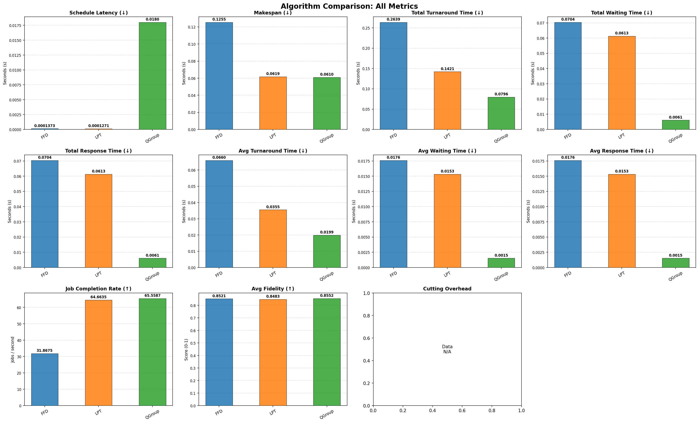

### Individual Metric Comparisons

#### Schedule Latency

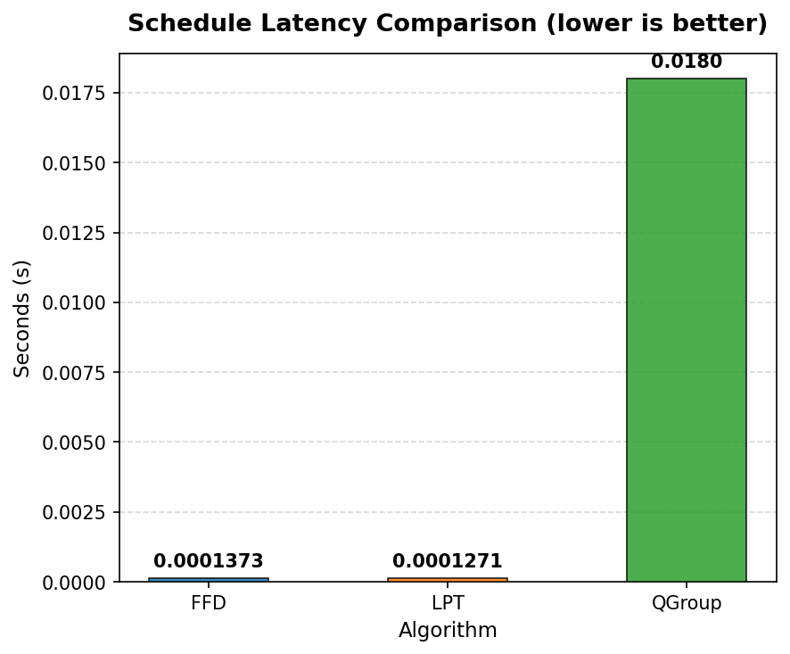

#### Makespan

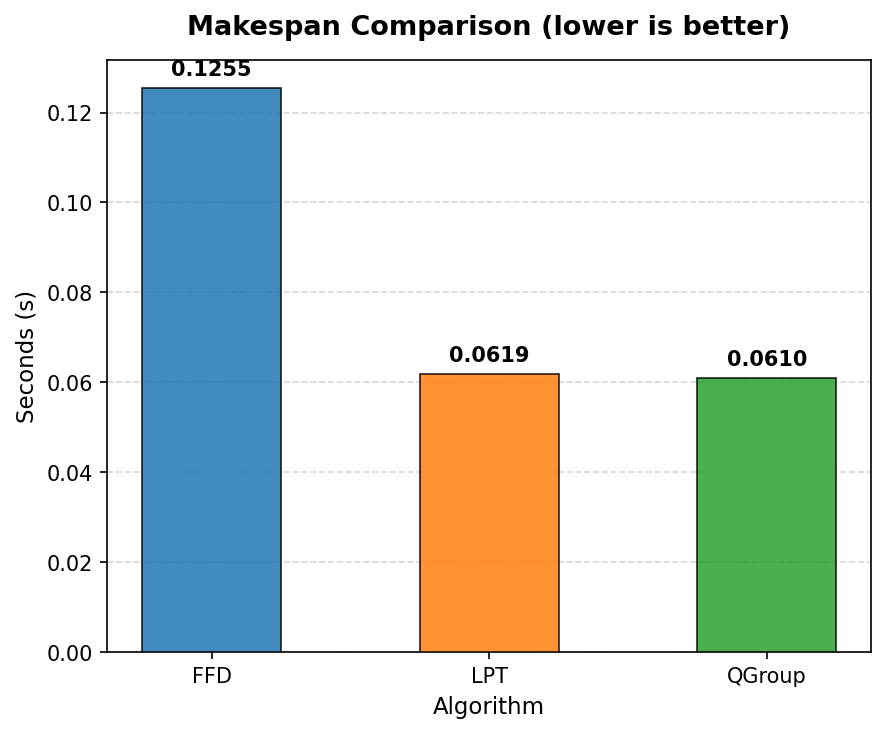

#### Total Turnaround Time

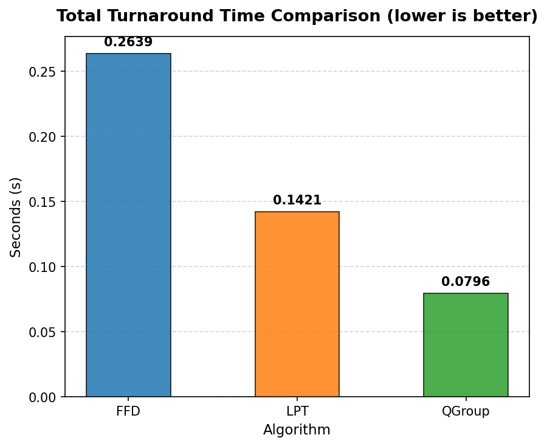

#### Total Waiting Time

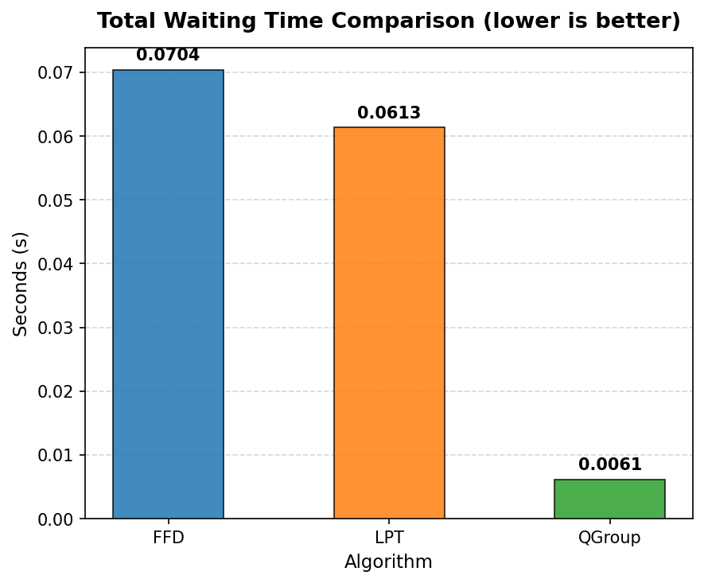

#### Total Response Time

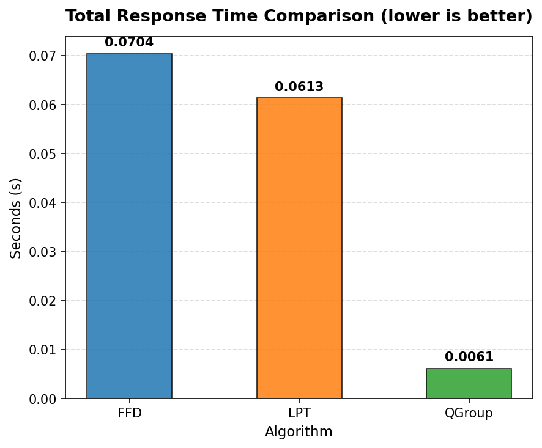

#### Avg Turnaround Time

#### Avg Waiting Time

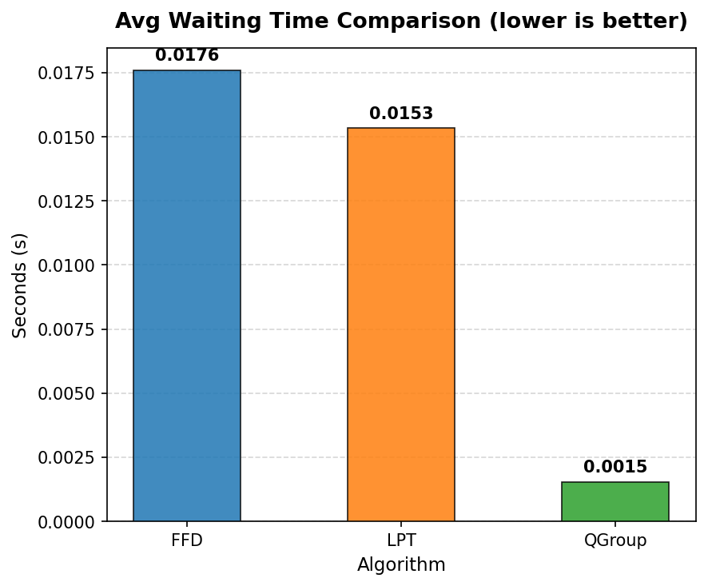

#### Avg Response Time

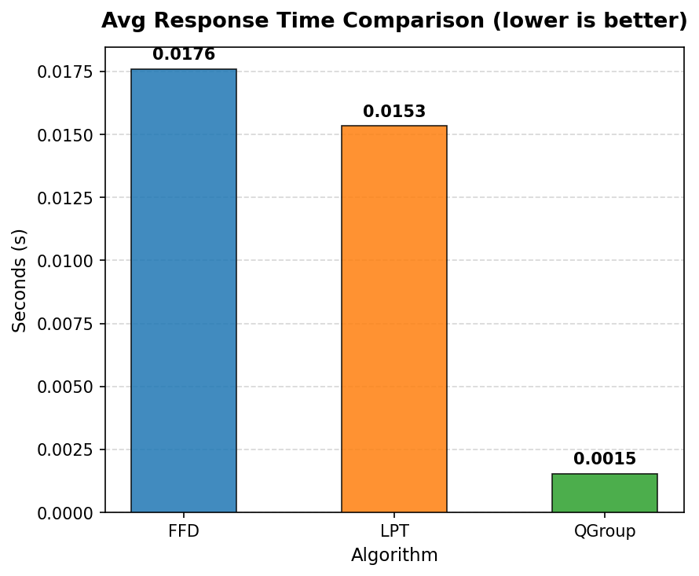

#### Job Completion Rate

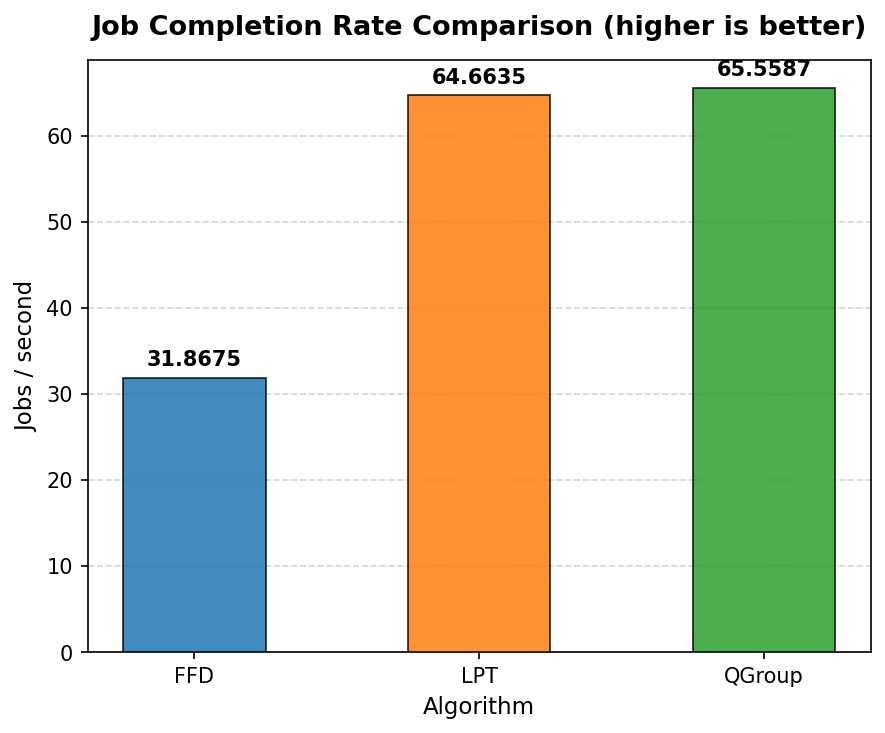

#### Avg Fidelity

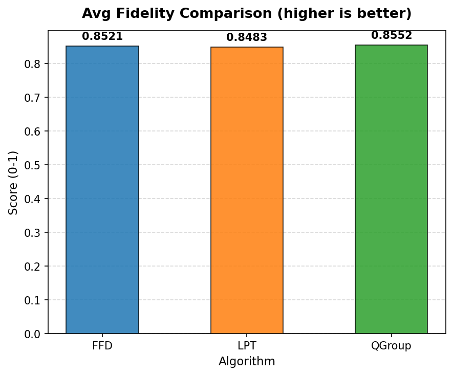

#### Cutting Overhead

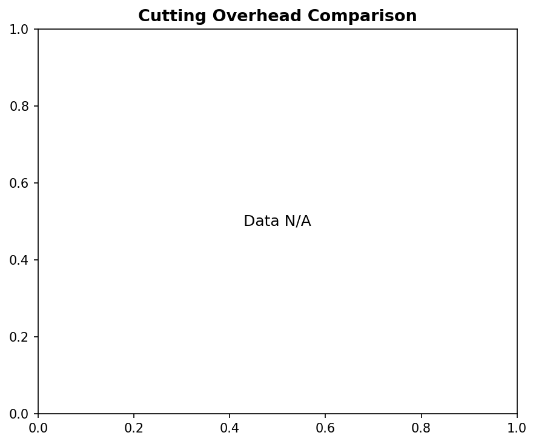

### Job Outcomes

### Machine Utilization

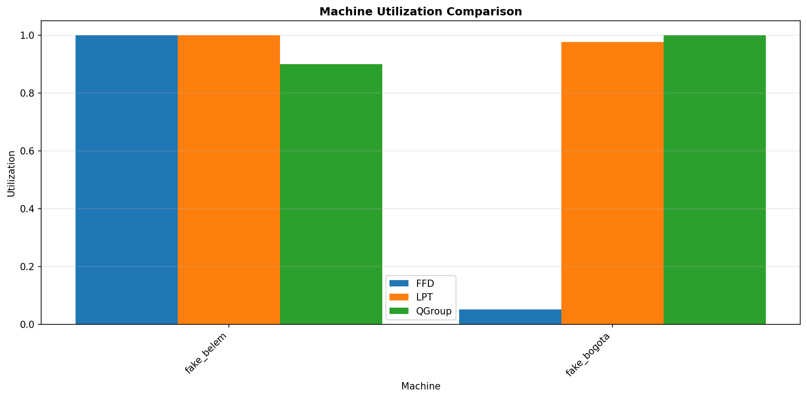

