# Quantum Scheduling Batch Results Comparison

## Execution Status

| Algorithm | Status | Error |
|-----------|--------|-------|
| FFD | ✅ SUCCESS |  |
| LPT | ✅ SUCCESS |  |
| QGroup | ✅ SUCCESS |  |

## Workload and Configuration

- **Circuits**: 4 (ghz)
- **Average Qubits**: 3.5
- **Machines**: ["fake_belem", "fake_bogota"]
- **Seed**: 0
- **Queue Policy**: strict
- **Baseline Algorithm**: FFD

## Scheduling Latency (wall-clock)

| Algorithm | Latency (s) | Difference from baseline |
|-----------|-------------|-------------------------|
| FFD | 0.0001597 | baseline |
| LPT | 0.0001361 | -2.36e-05 |
| QGroup | 0.0148 | +0.0146 |

## Execution Summary Metrics

All times in seconds (virtual execution time) unless specified otherwise.

| Metric | FFD | LPT | QGroup |
|--------|--------|--------|--------|
| Schedule Latency | 0.0001597 | 0.0001361 (-2.36e-05, -14.78%) | 0.0148 (+0.0146, +9145.97%) |
| Makespan | 0.1104 | 0.0606 (-0.0498, -45.08%) | 0.0588 (-0.0516, -46.72%) |
| Total Turnaround Time | 0.2336 | 0.0850 (-0.1486, -63.62%) | 0.0774 (-0.1562, -66.87%) |
| Total Waiting Time | 0.0527 | 0.0126 (-0.0401, -76.09%) | 0.0061 (-0.0467, -88.46%) |
| Total Response Time | 0.0527 | 0.0126 (-0.0401, -76.09%) | 0.0061 (-0.0467, -88.46%) |
| Avg Turnaround Time | 0.0584 | 0.0212 (-0.0372, -63.62%) | 0.0194 (-0.0391, -66.87%) |
| Avg Waiting Time | 0.0132 | 0.0032 (-0.0100, -76.09%) | 0.0015 (-0.0117, -88.46%) |
| Avg Response Time | 0.0132 | 0.0032 (-0.0100, -76.09%) | 0.0015 (-0.0117, -88.46%) |
| Job Completion Rate | 36.2334 | 65.9760 (+29.7426, +82.09%) | 68.0057 (+31.7723, +87.69%) |
| Avg Fidelity | 0.8616 | 0.8706 (+0.0090, +1.05%) | 0.8739 (+0.0123, +1.43%) |
| Cutting Overhead | 9.0000 | 9.0000 (0.0, 0.00%) | 9.0000 (0.0, 0.00%) |

**Metric Definitions:**

- **Schedule Latency**: Wall-clock scheduling decision time (s)
- **Makespan**: Total virtual execution time (s)
- **Total Turnaround Time**: Sum of all job turnaround times (s)
- **Total Waiting Time**: Sum of all job waiting times (s)
- **Total Response Time**: Sum of all job response times (s)
- **Avg Turnaround Time**: Mean turnaround time across jobs (s)
- **Avg Waiting Time**: Mean waiting time across jobs (s)
- **Avg Response Time**: Mean response time across jobs (s)
- **Job Completion Rate**: Throughput: completed jobs / makespan
- **Avg Fidelity**: Mean quantum circuit execution fidelity
- **Cutting Overhead**: Total sampling overhead incurred from circuit cutting

**Note**: Values in parentheses show (difference from baseline, % change)

## Job Outcomes

| Algorithm | Succeeded | Failed | Blocked | Total |
|-----------|-----------|--------|---------|-------|
| FFD | 4 | 0 | 0 | 4 |
| LPT | 4 | 0 | 0 | 4 |
| QGroup | 4 | 0 | 0 | 4 |

## Machine Utilization

| Machine | FFD Util | LPT Util | QGroup Util | FFD Busy Time | LPT Busy Time | QGroup Busy Time |
|---|---|---|---|---|---|---|
| fake_belem | 1.0000 | 0.9808 | 1.0000 | 0.11s | 0.06s | 0.06s |
| fake_bogota | 0.0582 | 1.0000 | 0.9401 | 0.01s | 0.06s | 0.06s |

**Note**: Utilization measures logical qubit allocation over capacity × makespan.

## Batch Execution Records

### FFD Batches

Total batches: 3

| Batch | Machine | Jobs | Shots | Start | End | Duration | Status |
|-------|---------|------|-------|-------|-----|----------|--------|
| 1 | fake_belem | 1 | 1024 | 0.00s | 0.05s | 0.05s | SUCCEEDED |
| 2 | fake_bogota | 2 | 1024 | 0.00s | 0.01s | 0.01s | SUCCEEDED |
| 3 | fake_belem | 2 | 1024 | 0.05s | 0.11s | 0.06s | SUCCEEDED |

### LPT Batches

Total batches: 5

| Batch | Machine | Jobs | Shots | Start | End | Duration | Status |
|-------|---------|------|-------|-------|-----|----------|--------|
| 1 | fake_belem | 1 | 1024 | 0.00s | 0.01s | 0.01s | SUCCEEDED |
| 2 | fake_bogota | 1 | 1024 | 0.00s | 0.01s | 0.01s | SUCCEEDED |
| 3 | fake_bogota | 1 | 1024 | 0.01s | 0.01s | 0.01s | SUCCEEDED |
| 4 | fake_belem | 1 | 1024 | 0.01s | 0.06s | 0.05s | SUCCEEDED |
| 5 | fake_bogota | 1 | 1024 | 0.01s | 0.06s | 0.05s | SUCCEEDED |

### QGroup Batches

Total batches: 4

| Batch | Machine | Jobs | Shots | Start | End | Duration | Status |
|-------|---------|------|-------|-------|-----|----------|--------|
| 1 | fake_belem | 2 | 1024 | 0.00s | 0.01s | 0.01s | SUCCEEDED |
| 2 | fake_bogota | 1 | 1024 | 0.00s | 0.01s | 0.01s | SUCCEEDED |
| 3 | fake_belem | 1 | 1024 | 0.01s | 0.06s | 0.05s | SUCCEEDED |
| 4 | fake_bogota | 1 | 1024 | 0.01s | 0.06s | 0.05s | SUCCEEDED |

## Visualizations

### Overview Metrics Comparison

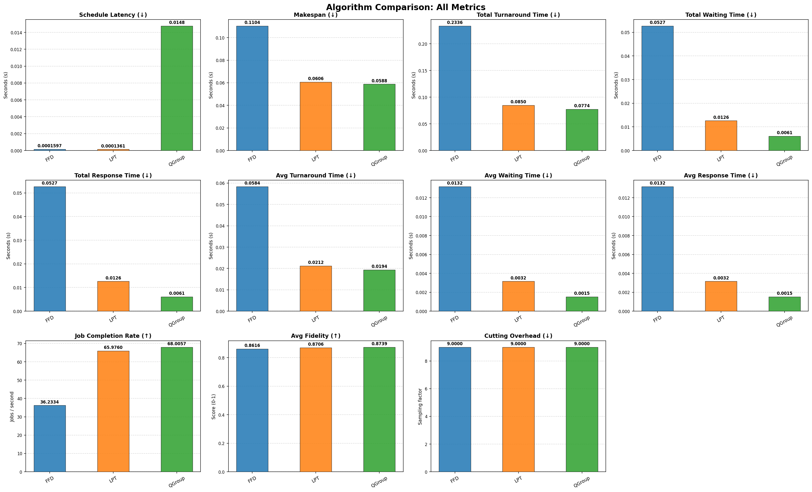

### Individual Metric Comparisons

#### Schedule Latency

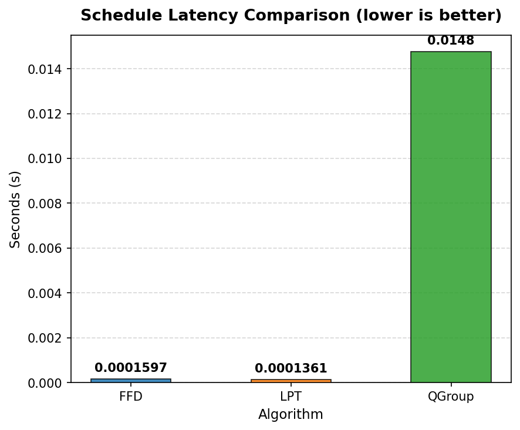

#### Makespan

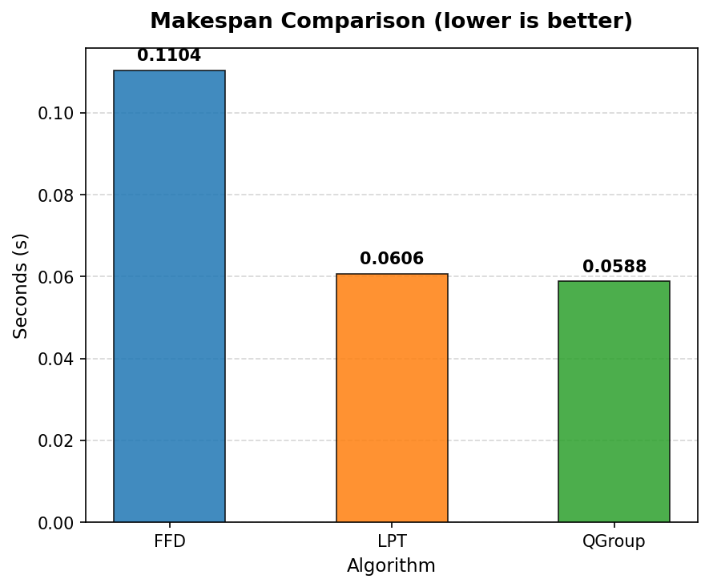

#### Total Turnaround Time

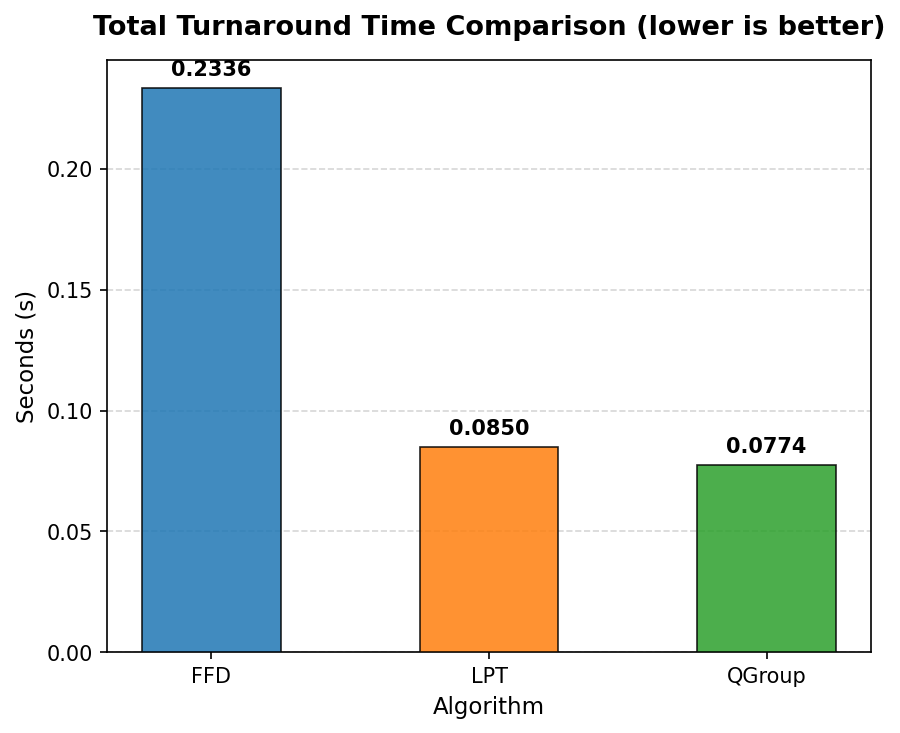

#### Total Waiting Time

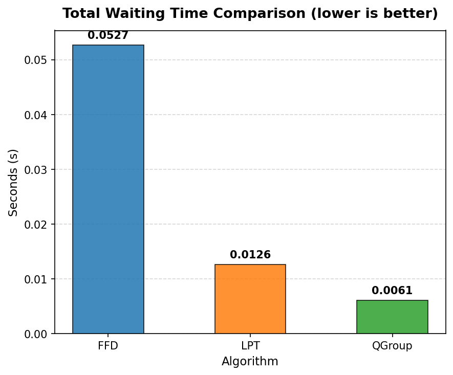

#### Total Response Time

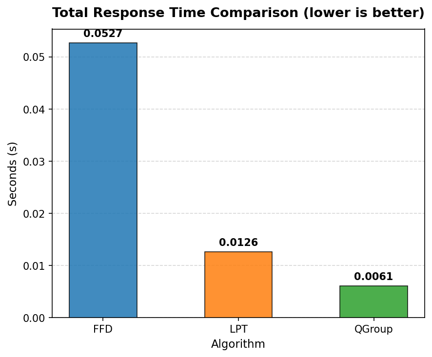

#### Avg Turnaround Time

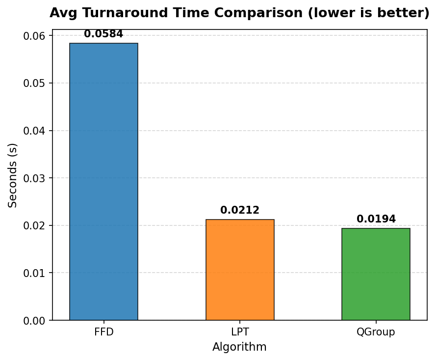

#### Avg Waiting Time

#### Avg Response Time

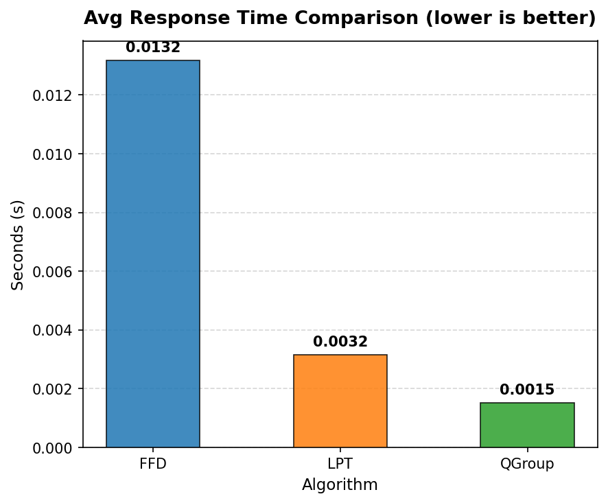

#### Job Completion Rate

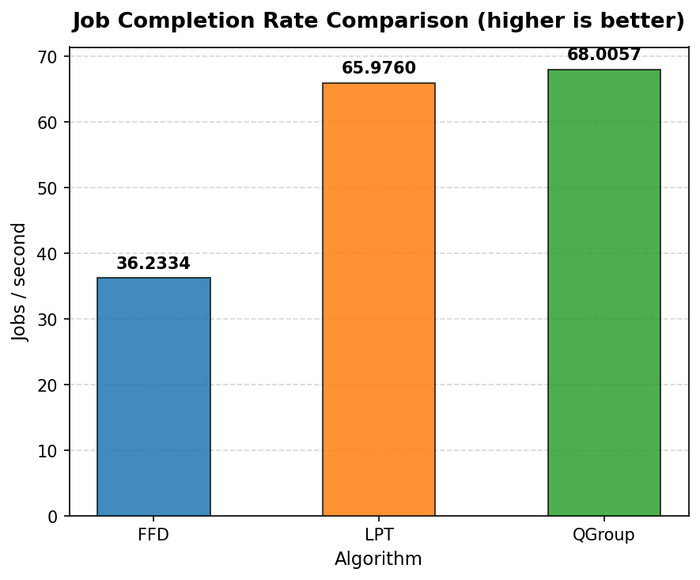

#### Avg Fidelity

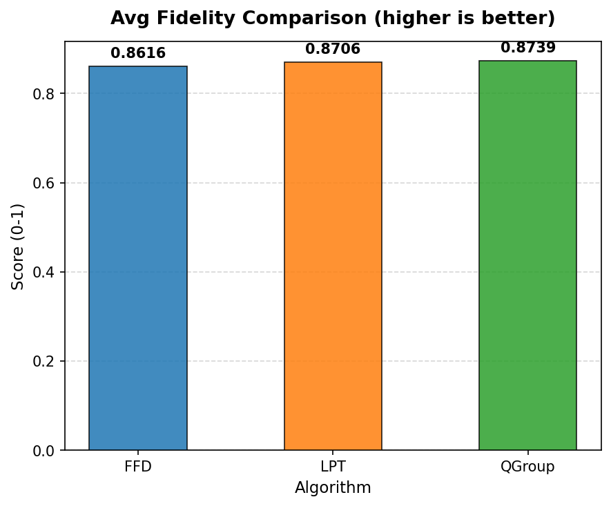

#### Cutting Overhead

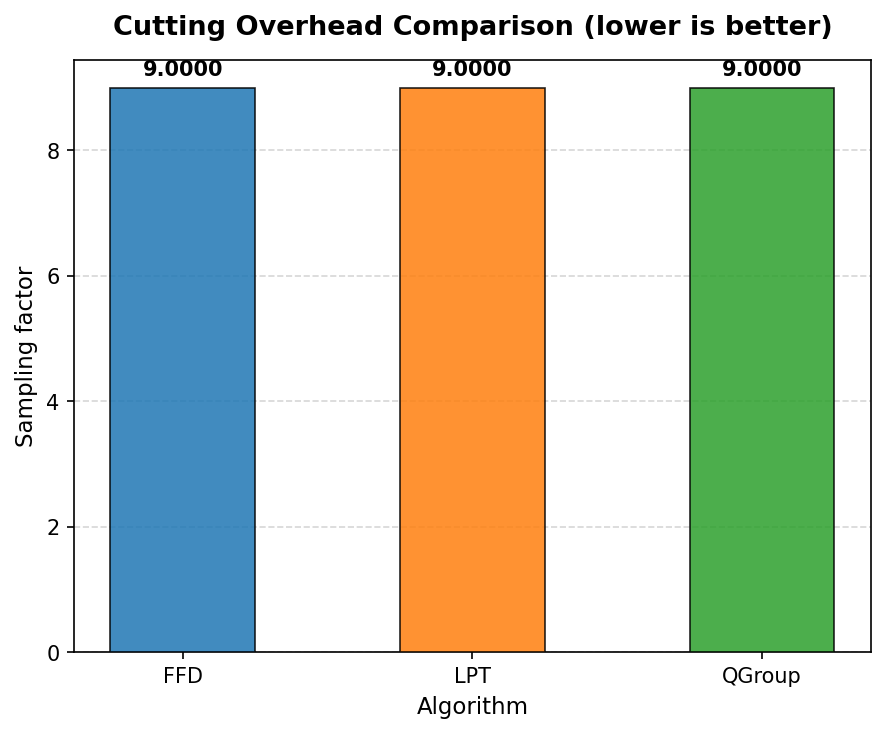

### Job Outcomes

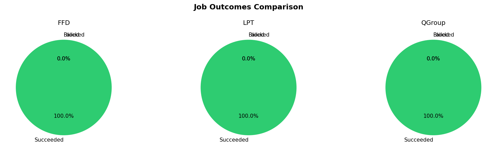

### Machine Utilization

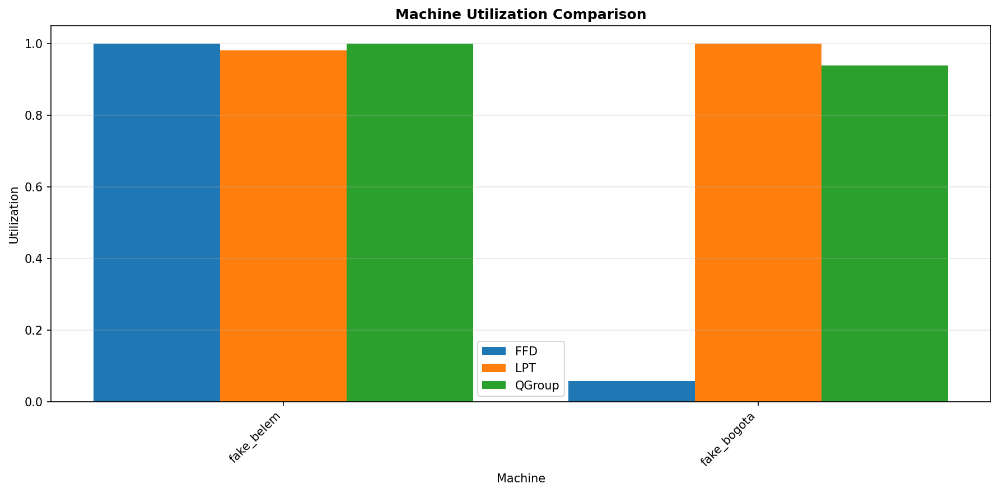

