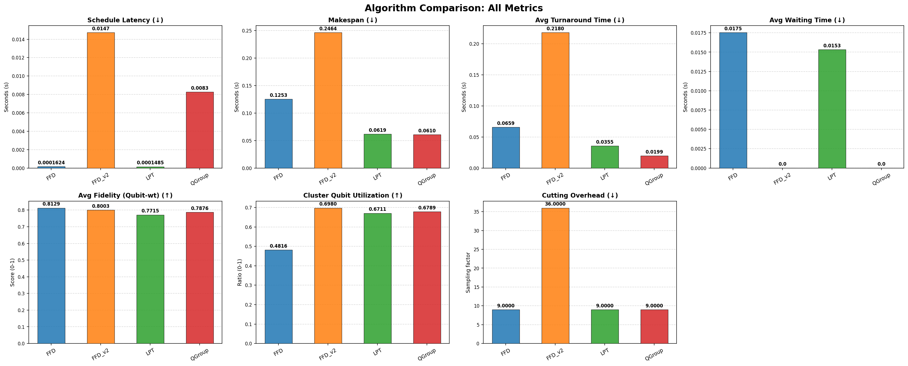
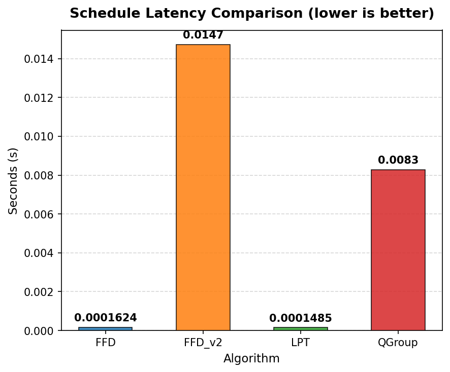
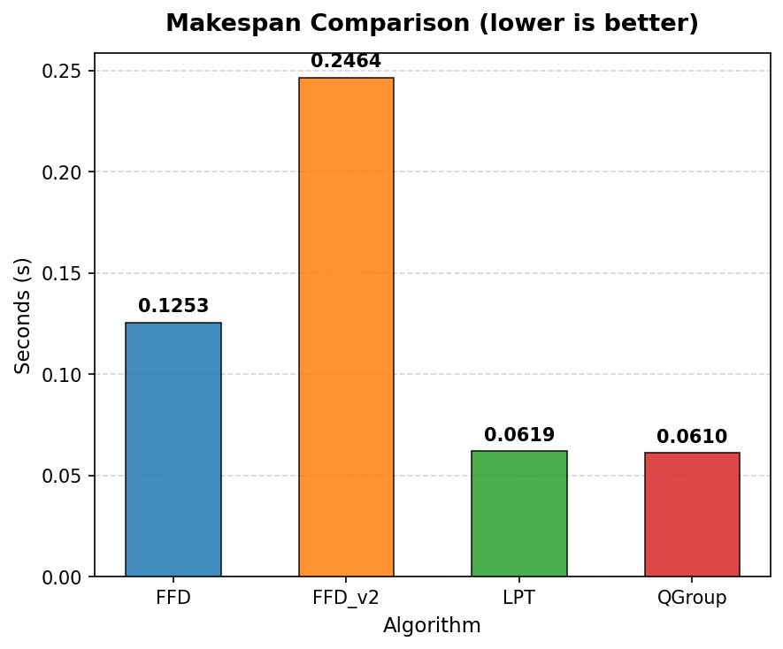
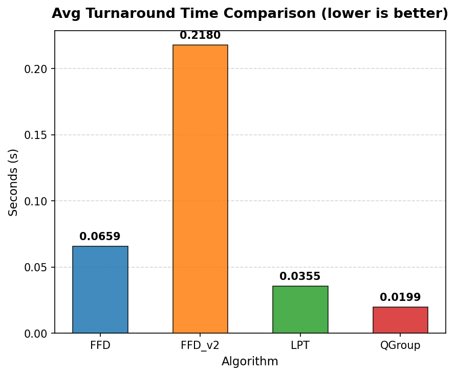
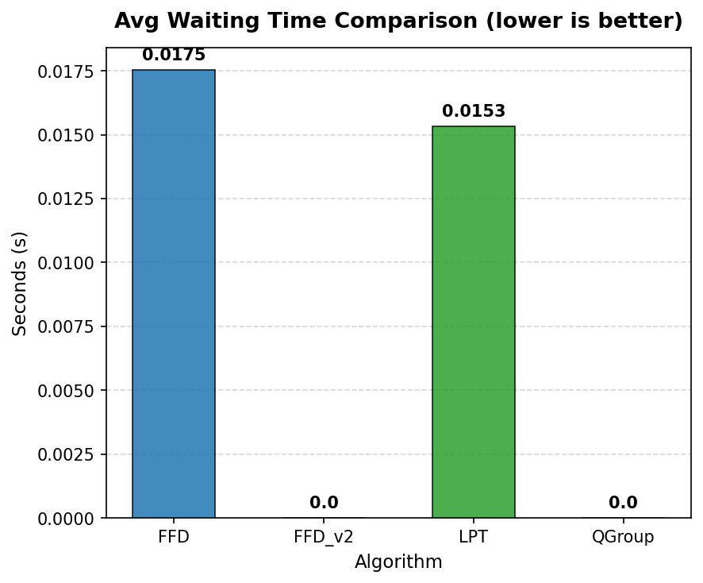
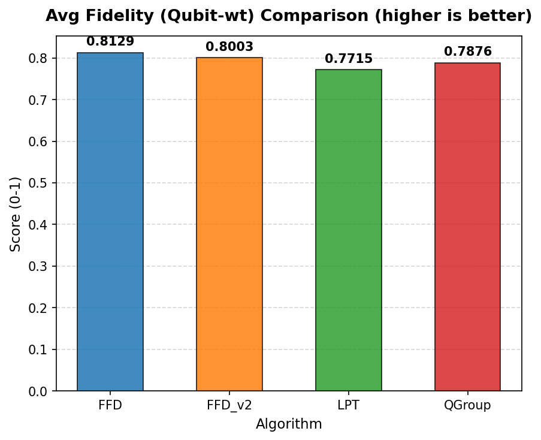
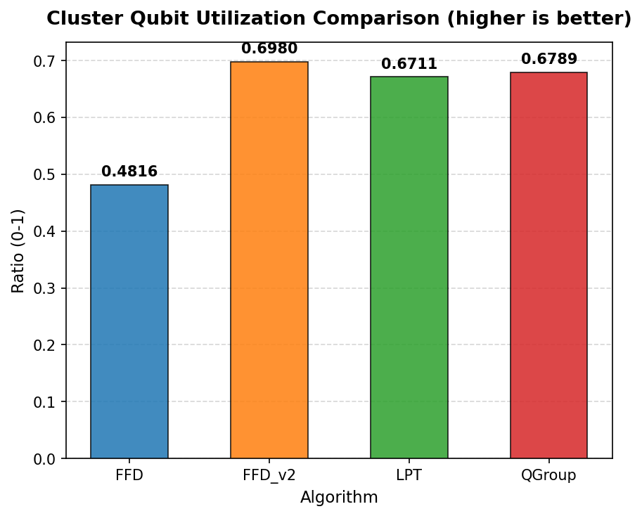
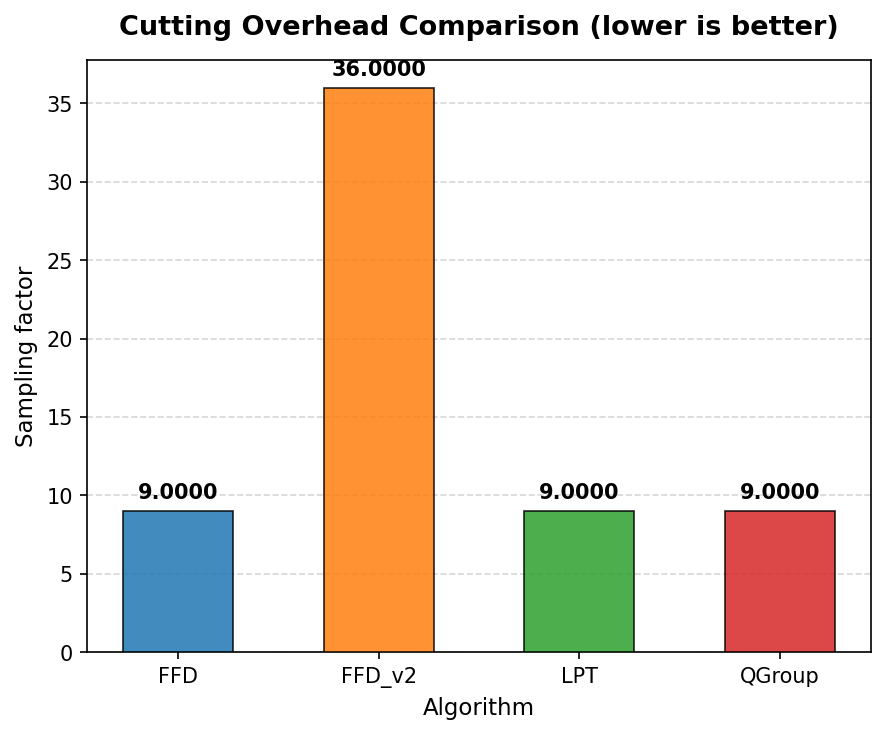
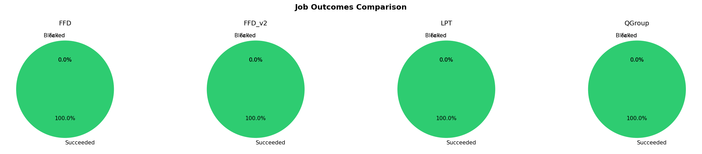
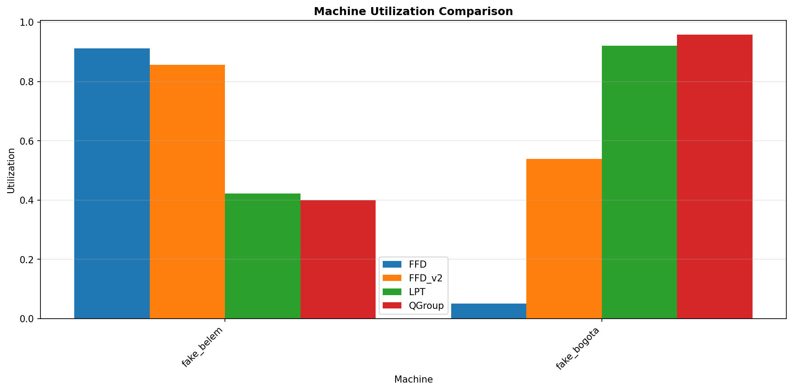

# Quantum Scheduling Batch Results Comparison

## Execution Status

| Algorithm | Status | Error |
|-----------|--------|-------|
| FFD | ✅ SUCCESS |  |
| FFD_v2 | ✅ SUCCESS |  |
| LPT | ✅ SUCCESS |  |
| QGroup | ✅ SUCCESS |  |

## Workload and Configuration

- **Circuits**: 4 (ghz)
- **Average Qubits**: 3.5
- **Machines**: ["fake_belem", "fake_bogota"]
- **Seed**: 0
- **Cutting Policy**: greedy (scope: )
- **Queue / Backfill Policy**: relaxed
- **Baseline Algorithm**: FFD

## Scheduling Latency (wall-clock)

| Algorithm | Latency (s) | Difference from baseline |
|-----------|-------------|-------------------------|
| FFD | 0.0001624 | baseline |
| FFD_v2 | 0.0147 | +0.0146 |
| LPT | 0.0001485 | -1.383e-05 |
| QGroup | 0.0083 | +0.0081 |

## Execution Summary Metrics

All times in seconds (virtual execution time) unless specified otherwise.

| Metric | FFD | FFD_v2 | LPT | QGroup |
|--------|--------|--------|--------|--------|
| Schedule Latency | 0.0001624 | 0.0147 (+0.0146, +8972.39%) | 0.0001485 (-1.383e-05, -8.52%) | 0.0083 (+0.0081, +4993.10%) |
| Makespan | 0.1253 | 0.2464 (+0.1211, +96.67%) | 0.0619 (-0.0634, -50.63%) | 0.0610 (-0.0643, -51.31%) |
| Avg Turnaround Time | 0.0659 | 0.2180 (+0.1522, +231.05%) | 0.0355 (-0.0303, -46.06%) | 0.0199 (-0.0460, -69.78%) |
| Avg Waiting Time | 0.0175 | 0.0 (-0.0175, -100.00%) | 0.0153 (-0.0022, -12.61%) | 0.0 (-0.0175, -100.00%) |
| Avg Fidelity (Qubit-wt) | 0.8129 | 0.8003 (-0.0126, -1.54%) | 0.7715 (-0.0413, -5.08%) | 0.7876 (-0.0252, -3.11%) |
| Cluster Qubit Utilization | 0.4816 | 0.6980 (+0.2164, +44.93%) | 0.6711 (+0.1895, +39.35%) | 0.6789 (+0.1972, +40.95%) |
| Cutting Overhead | 9.0000 | 36.0000 (+27.0000, +300.00%) | 9.0000 (0.0, 0.00%) | 9.0000 (0.0, 0.00%) |

**Metric Definitions:**

- **Schedule Latency**: Wall-clock scheduling decision time (s)
- **Makespan**: Total virtual execution time (s)
- **Avg Turnaround Time**: Mean turnaround time across jobs (s)
- **Avg Waiting Time**: Mean actual waiting time in queue (s)
- **Avg Fidelity (Qubit-wt)**: Mean quantum circuit fidelity weighted by circuit qubits
- **Cluster Qubit Utilization**: Qubit space-time allocation over total cluster capacity × makespan
- **Cutting Overhead**: Total sampling overhead incurred from circuit cutting

**Note**: Values in parentheses show (difference from baseline, % change)

## Job Outcomes

| Algorithm | Succeeded | Failed | Blocked | Total |
|-----------|-----------|--------|---------|-------|
| FFD | 4 | 0 | 0 | 4 |
| FFD_v2 | 4 | 0 | 0 | 4 |
| LPT | 4 | 0 | 0 | 4 |
| QGroup | 4 | 0 | 0 | 4 |

## Machine Utilization

| Machine | FFD Util | FFD_v2 Util | LPT Util | QGroup Util | FFD Busy Time | FFD_v2 Busy Time | LPT Busy Time | QGroup Busy Time |
|---|---|---|---|---|---|---|---|---|
| fake_belem | 0.9120 | 0.8570 | 0.4218 | 0.3998 | 0.13s | 0.25s | 0.06s | 0.05s |
| fake_bogota | 0.0513 | 0.5391 | 0.9205 | 0.9579 | 0.01s | 0.13s | 0.06s | 0.06s |

**Note**: Utilization measures logical qubit allocation over capacity × makespan.

## Batch Execution Records

### FFD Batches

Total batches: 3

| Batch | Machine | Jobs | Shots | Start | End | Duration | Status |
|-------|---------|------|-------|-------|-----|----------|--------|
| 1 | fake_belem | 1 | 1024 | 0.00s | 0.07s | 0.07s | SUCCEEDED |
| 2 | fake_bogota | 2 | 1024 | 0.00s | 0.01s | 0.01s | SUCCEEDED |
| 3 | fake_belem | 2 | 1024 | 0.07s | 0.13s | 0.06s | SUCCEEDED |

### FFD_v2 Batches

Total batches: 3

| Batch | Machine | Jobs | Shots | Start | End | Duration | Status |
|-------|---------|------|-------|-------|-----|----------|--------|
| 1 | fake_belem | 1 | 1024 | 0.00s | 0.07s | 0.07s | SUCCEEDED |
| 2 | fake_bogota | 3 | 1024 | 0.00s | 0.13s | 0.13s | SUCCEEDED |
| 3 | fake_belem | 4 | 1024 | 0.07s | 0.25s | 0.18s | SUCCEEDED |

### LPT Batches

Total batches: 5

| Batch | Machine | Jobs | Shots | Start | End | Duration | Status |
|-------|---------|------|-------|-------|-----|----------|--------|
| 1 | fake_belem | 1 | 1024 | 0.00s | 0.01s | 0.01s | SUCCEEDED |
| 2 | fake_bogota | 1 | 1024 | 0.00s | 0.05s | 0.05s | SUCCEEDED |
| 3 | fake_belem | 1 | 1024 | 0.01s | 0.01s | 0.01s | SUCCEEDED |
| 4 | fake_belem | 1 | 1024 | 0.01s | 0.06s | 0.05s | SUCCEEDED |
| 5 | fake_bogota | 1 | 1024 | 0.05s | 0.06s | 0.01s | SUCCEEDED |

### QGroup Batches

Total batches: 4

| Batch | Machine | Jobs | Shots | Start | End | Duration | Status |
|-------|---------|------|-------|-------|-----|----------|--------|
| 1 | fake_belem | 2 | 1024 | 0.00s | 0.01s | 0.01s | SUCCEEDED |
| 2 | fake_bogota | 1 | 1024 | 0.00s | 0.01s | 0.01s | SUCCEEDED |
| 3 | fake_belem | 1 | 1024 | 0.01s | 0.05s | 0.05s | SUCCEEDED |
| 4 | fake_bogota | 1 | 1024 | 0.01s | 0.06s | 0.05s | SUCCEEDED |

## Visualizations

### Overview Metrics Comparison

### Individual Metric Comparisons

#### Schedule Latency

#### Makespan

#### Avg Turnaround Time

#### Avg Waiting Time

#### Avg Fidelity (Qubit-wt)

#### Cluster Qubit Utilization

#### Cutting Overhead

### Job Outcomes

### Machine Utilization

