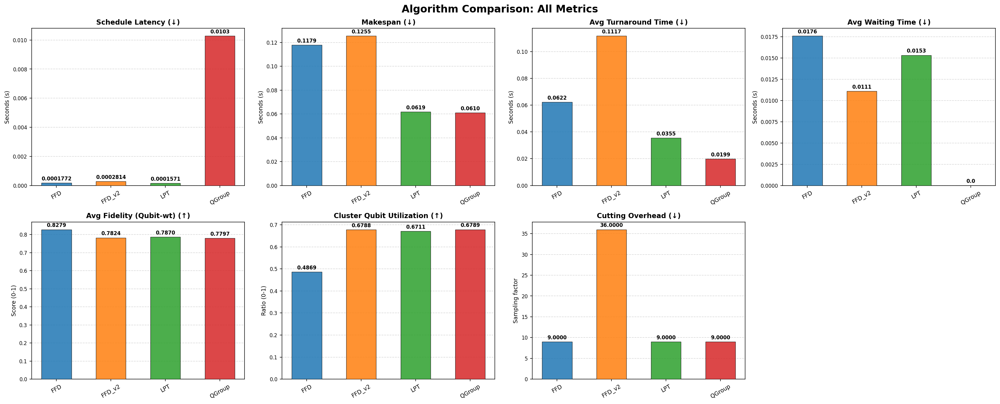
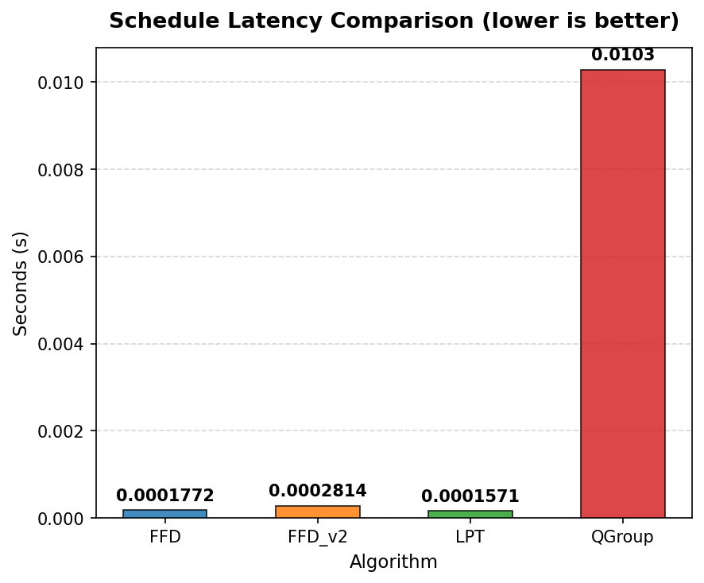
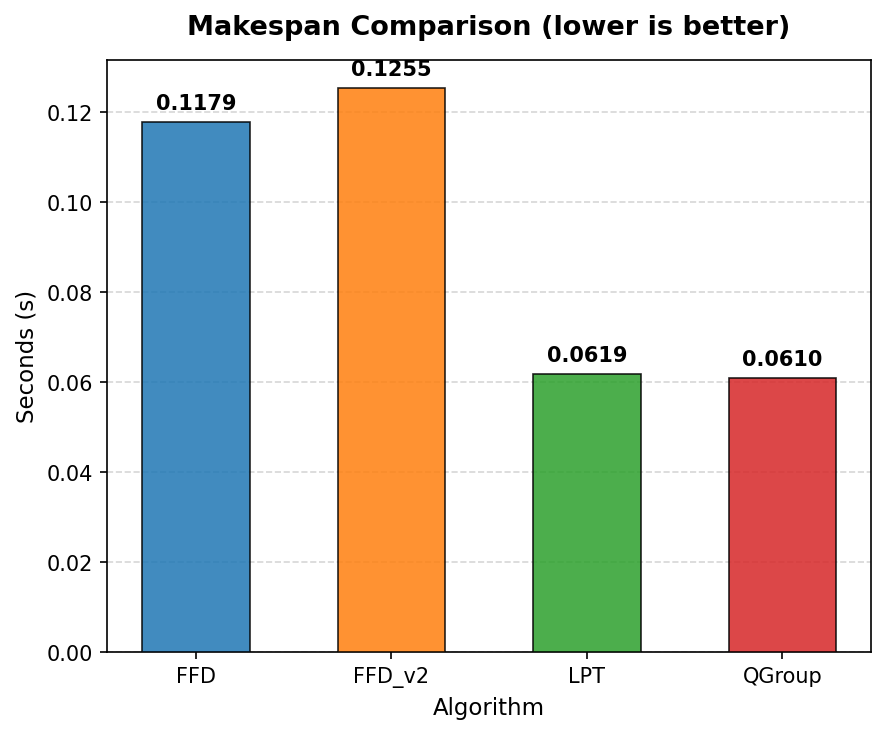
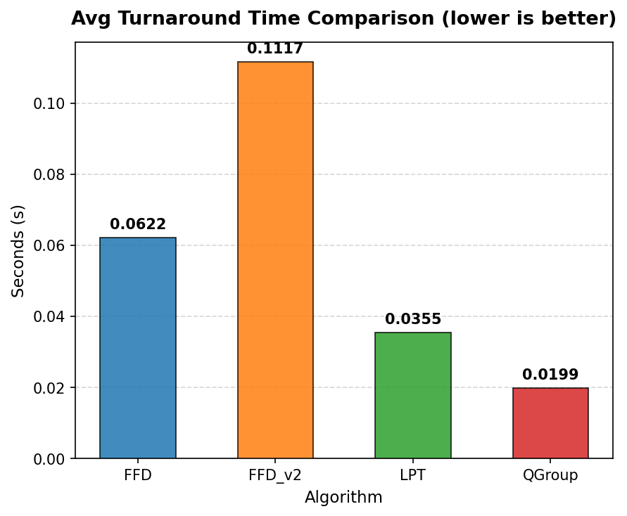
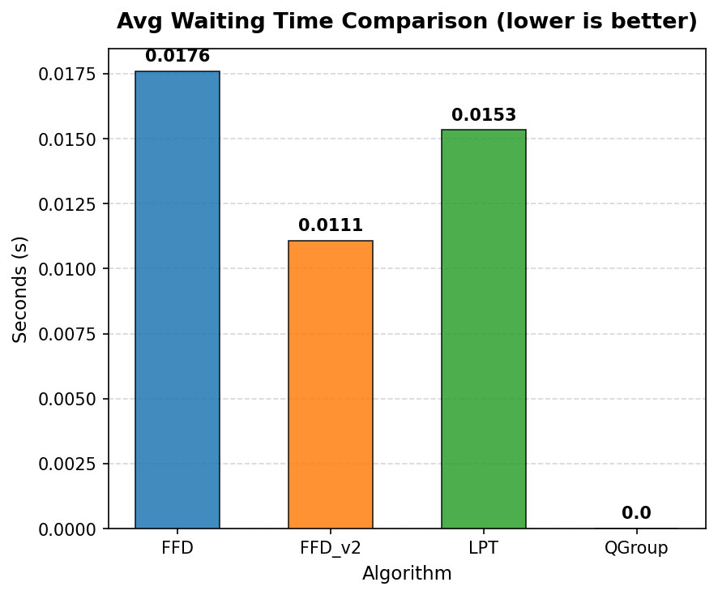
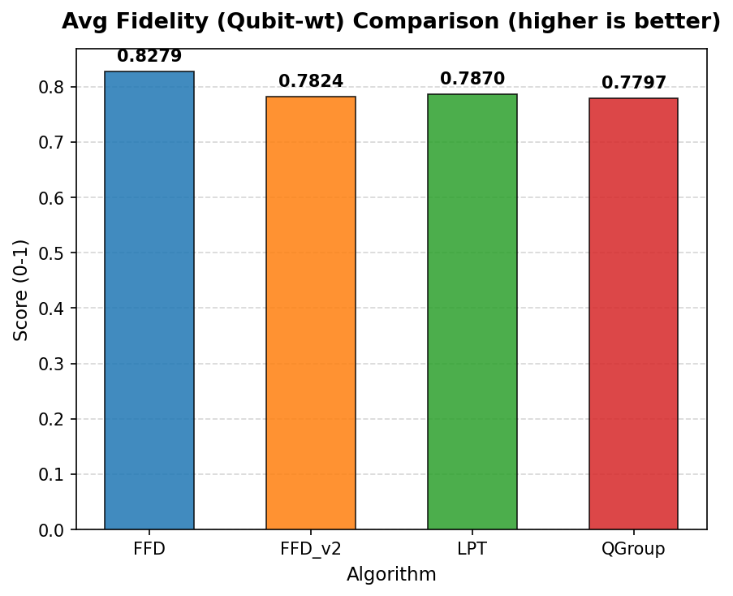
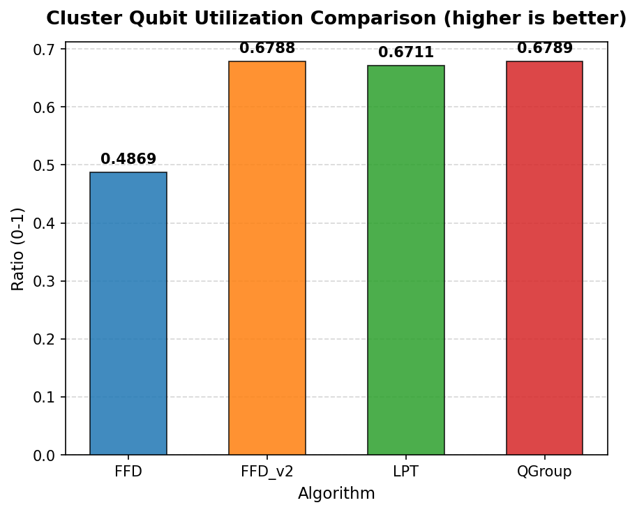
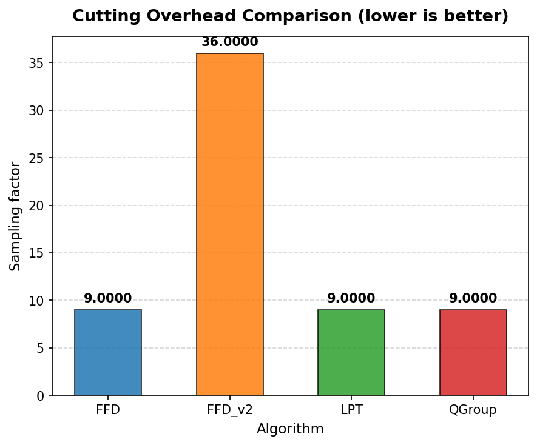
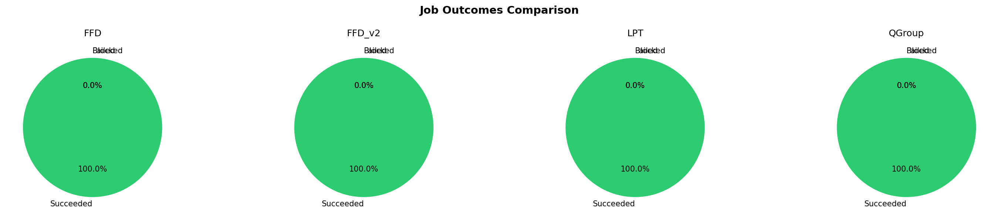
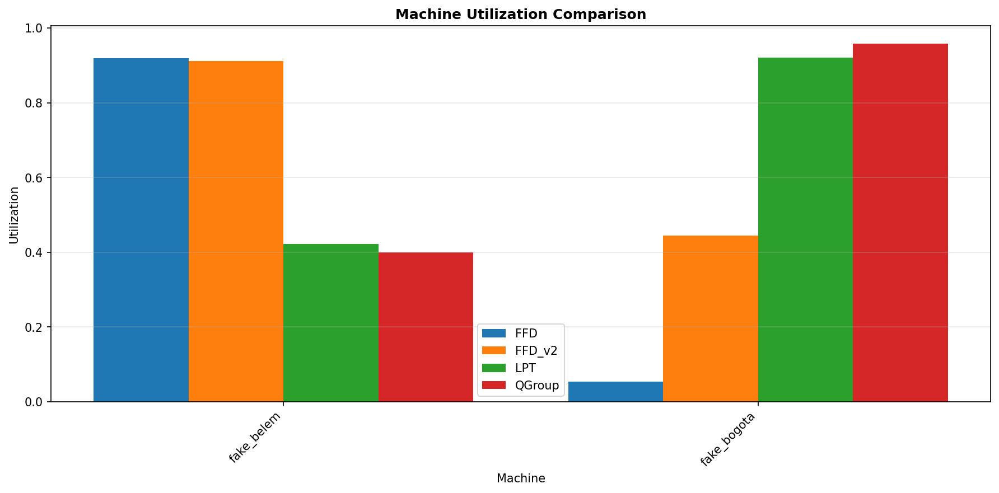

# Quantum Scheduling Batch Results Comparison

## Execution Status

| Algorithm | Status | Error |
|-----------|--------|-------|
| FFD | ✅ SUCCESS |  |
| FFD_v2 | ✅ SUCCESS |  |
| LPT | ✅ SUCCESS |  |
| QGroup | ✅ SUCCESS |  |

## Workload and Configuration

- **Circuits**: 4 (ghz)
- **Average Qubits**: 3.5
- **Machines**: ["fake_belem", "fake_bogota"]
- **Queue / Backfill Policy**: strict
- **Baseline Algorithm**: FFD

### Circuit Cutting Configurations

| Algorithm | Mandatory Cut (Exceed) | Optional Cut (Remaining) |
|-----------|------------------------|-------------------------|
| FFD | greedy | Disabled (exceed only) |
| FFD_v2 | greedy | Enabled (half) |
| LPT | greedy | Disabled (exceed only) |
| QGroup | greedy | Disabled (exceed only) |

## Scheduling Latency (wall-clock)

| Algorithm | Latency (s) | Difference from baseline |
|-----------|-------------|-------------------------|
| FFD | 0.0001772 | baseline |
| FFD_v2 | 0.0002814 | +0.0001 |
| LPT | 0.0001571 | -2.008e-05 |
| QGroup | 0.0103 | +0.0101 |

## Execution Summary Metrics

All times in seconds (virtual execution time) unless specified otherwise.

| Metric | FFD | FFD_v2 | LPT | QGroup |
|--------|--------|--------|--------|--------|
| Schedule Latency | 0.0001772 | 0.0002814 (+0.0001, +58.78%) | 0.0001571 (-2.008e-05, -11.33%) | 0.0103 (+0.0101, +5703.53%) |
| Makespan | 0.1179 | 0.1255 (+0.0076, +6.40%) | 0.0619 (-0.0561, -47.55%) | 0.0610 (-0.0569, -48.26%) |
| Avg Turnaround Time | 0.0622 | 0.1117 (+0.0495, +79.67%) | 0.0355 (-0.0267, -42.86%) | 0.0199 (-0.0423, -67.99%) |
| Avg Waiting Time | 0.0176 | 0.0111 (-0.0065, -37.02%) | 0.0153 (-0.0023, -12.88%) | 0.0 (-0.0176, -100.00%) |
| Avg Fidelity (Qubit-wt) | 0.8279 | 0.7824 (-0.0454, -5.49%) | 0.7870 (-0.0409, -4.94%) | 0.7797 (-0.0482, -5.82%) |
| Cluster Qubit Utilization | 0.4869 | 0.6788 (+0.1918, +39.40%) | 0.6711 (+0.1842, +37.83%) | 0.6789 (+0.1919, +39.42%) |
| Cutting Overhead | 9.0000 | 36.0000 (+27.0000, +300.00%) | 9.0000 (0.0, 0.00%) | 9.0000 (0.0, 0.00%) |

**Metric Definitions:**

- **Schedule Latency**: Wall-clock scheduling decision time (s)
- **Makespan**: Total virtual execution time (s)
- **Avg Turnaround Time**: Mean turnaround time across jobs (s)
- **Avg Waiting Time**: Mean actual waiting time in queue (s)
- **Avg Fidelity (Qubit-wt)**: Mean quantum circuit fidelity weighted by circuit qubits
- **Cluster Qubit Utilization**: Qubit space-time allocation over total cluster capacity × makespan
- **Cutting Overhead**: Total sampling overhead incurred from circuit cutting

**Note**: Values in parentheses show (difference from baseline, % change)

## Job Outcomes

| Algorithm | Succeeded | Failed | Blocked | Total |
|-----------|-----------|--------|---------|-------|
| FFD | 4 | 0 | 0 | 4 |
| FFD_v2 | 4 | 0 | 0 | 4 |
| LPT | 4 | 0 | 0 | 4 |
| QGroup | 4 | 0 | 0 | 4 |

## Machine Utilization

| Machine | FFD Util | FFD_v2 Util | LPT Util | QGroup Util | FFD Busy Time | FFD_v2 Busy Time | LPT Busy Time | QGroup Busy Time |
|---|---|---|---|---|---|---|---|---|
| fake_belem | 0.9194 | 0.9122 | 0.4218 | 0.3998 | 0.12s | 0.13s | 0.06s | 0.05s |
| fake_bogota | 0.0545 | 0.4453 | 0.9205 | 0.9579 | 0.01s | 0.06s | 0.06s | 0.06s |

**Note**: Utilization measures logical qubit allocation over capacity × makespan.

## Batch Execution Records

### FFD Batches

Total batches: 3

| Batch | Machine | Jobs | Shots | Start | End | Duration | Status |
|-------|---------|------|-------|-------|-----|----------|--------|
| 1 | fake_belem | 1 | 1024 | 0.00s | 0.07s | 0.07s | SUCCEEDED |
| 2 | fake_bogota | 2 | 1024 | 0.00s | 0.01s | 0.01s | SUCCEEDED |
| 3 | fake_belem | 2 | 1024 | 0.07s | 0.12s | 0.05s | SUCCEEDED |

### FFD_v2 Batches

Total batches: 3

| Batch | Machine | Jobs | Shots | Start | End | Duration | Status |
|-------|---------|------|-------|-------|-----|----------|--------|
| 1 | fake_belem | 1 | 1024 | 0.00s | 0.07s | 0.07s | SUCCEEDED |
| 2 | fake_bogota | 3 | 1024 | 0.00s | 0.06s | 0.06s | SUCCEEDED |
| 3 | fake_belem | 4 | 1024 | 0.07s | 0.13s | 0.06s | SUCCEEDED |

### LPT Batches

Total batches: 5

| Batch | Machine | Jobs | Shots | Start | End | Duration | Status |
|-------|---------|------|-------|-------|-----|----------|--------|
| 1 | fake_belem | 1 | 1024 | 0.00s | 0.01s | 0.01s | SUCCEEDED |
| 2 | fake_bogota | 1 | 1024 | 0.00s | 0.05s | 0.05s | SUCCEEDED |
| 3 | fake_belem | 1 | 1024 | 0.01s | 0.01s | 0.01s | SUCCEEDED |
| 4 | fake_belem | 1 | 1024 | 0.01s | 0.06s | 0.05s | SUCCEEDED |
| 5 | fake_bogota | 1 | 1024 | 0.05s | 0.06s | 0.01s | SUCCEEDED |

### QGroup Batches

Total batches: 4

| Batch | Machine | Jobs | Shots | Start | End | Duration | Status |
|-------|---------|------|-------|-------|-----|----------|--------|
| 1 | fake_belem | 2 | 1024 | 0.00s | 0.01s | 0.01s | SUCCEEDED |
| 2 | fake_bogota | 1 | 1024 | 0.00s | 0.01s | 0.01s | SUCCEEDED |
| 3 | fake_belem | 1 | 1024 | 0.01s | 0.05s | 0.05s | SUCCEEDED |
| 4 | fake_bogota | 1 | 1024 | 0.01s | 0.06s | 0.05s | SUCCEEDED |

## Visualizations

### Overview Metrics Comparison

### Individual Metric Comparisons

#### Schedule Latency

#### Makespan

#### Avg Turnaround Time

#### Avg Waiting Time

#### Avg Fidelity (Qubit-wt)

#### Cluster Qubit Utilization

#### Cutting Overhead

### Job Outcomes

### Machine Utilization

